## Synergy

Synergy is a plugin that can create random animations based on a variety of parameters.

At its core, Synergy has the notion of _steps_ and _modifiers_. Each step can contain one or more modifiers, which are used to drive certain parameters such as forces on a rigidbody or morph values. A step has a _duration_, which is used to synchronise the modifiers. Once the duration has elapsed, Synergy moves on to the next step.

## Table of contents
- [Table of contents](#table-of-contents)
- [Getting started](#getting-started)
  * [A simple head animation](#a-simple-head-animation)
  * [A ramping head and steady mouth](#a-ramping-head-and-steady-mouth)
- [User interface](#user-interface)
- [Step](#step)
  * [Progression](#progression)
  * [Half move](#half-move)
  * [Step duration](#step-duration)
  * [Repeat](#repeat)
  * [Delay](#delay)
- [Modifier](#modifier)
  * [Synchronisation](#synchronisation)
  * [Unsynced modifiers](#unsynced-modifiers)
  * [Step duration and unsynced modifiers](#step-duration-and-unsynced-modifiers)
  * [Rigidbody](#rigidbody)
  * [Morph](#morph)
  * [Light](#light)
  * [Audio](#audio)
- [Presets](#presets)
- [Monitor](#monitor)
- [Duration](#duration)
  * [Random range](#random-range)
  * [Ramp](#ramp)
- [Movement](#movement)
- [Easings](#easings)

## Getting started
After the plugin has been added, the user interface is empty. _Insert step after_ will add a new step.

[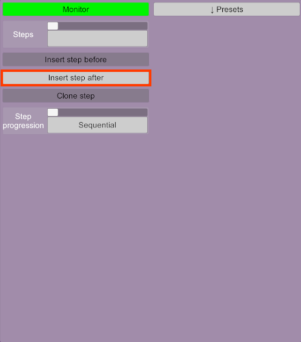](doc/empty.png)

Once a step has been added, _Add modifier_ will add a new modifier in this step.

[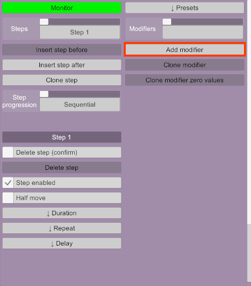](doc/empty-step.png)

Synergy now has one step and one modifier in this step.

[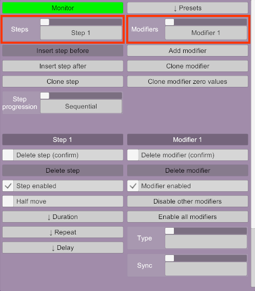](doc/base.png)

The left side is used to configure the step. The right side configures a modifier. The selected step or modifier can be changed in the list at the top. Other steps or modifiers can be added using the buttons below the lists.

Adding steps:

 - _Insert step before_: Adds a new step before the current one.
 - _Insert step after_: Adds a new step after the current one.
 - _Clone step_: Adds a new step after the current one with the same settings and modifiers as the current one.

Note that steps cannot currently be re-ordered.

Adding modifiers:

 - _Add modifier_: Adds a new modifier. Note that the order of modifiers doesn't matter and new modifiers are always added at the end. Modifiers are always executed concurrently.
 - _Clone modifier_: Adds a new modifier that is an exact copy of the current one.
 - _Clone modifier zero values_: Adds a new modifier that is a copy of the current one, except for any value that drives something, such as movements for rigidbodies. This is a useful shortcut when adding modifiers that are similar to the current one, without the character model moving unexpectedly because of compounding modifiers.

### A simple head animation

[Here's a video of the result](doc/head.mp4).

1) Add the script on a Person atom

2) Add a new step and a modifier inside that step

3) Change the duration of the step to 2 seconds

   [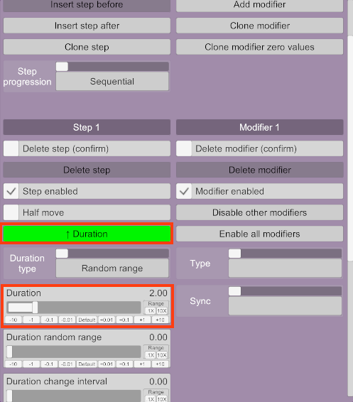](doc/head-1.png)

4) Set the modifier type to _Rigidbody_

   [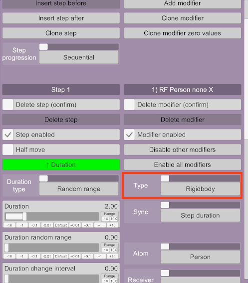](doc/head-2.png)

5) Set the _Receiver_ to _head_.

   [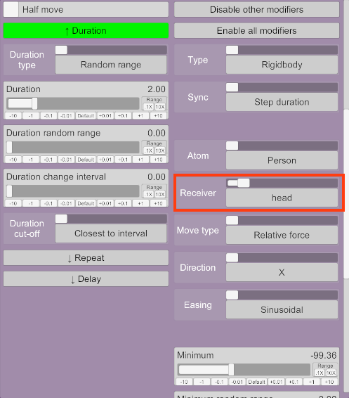](doc/head-3.png)

5) Change the _minimum_ to -100 and the _maximum_ to 100

   [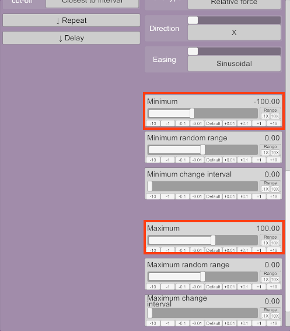](doc/head-4.png)

### A ramping head and steady mouth

[Here's a video of the result](doc/ramp.mp4).

1) Add a new step
  - Change its duration type to _Ramp_
  - Set _ramp time_ to 5s
  - Set _minimum_ to 2
  - Set _maximum_ to 0.5
  - Set _hold maximum_ to 3s

   [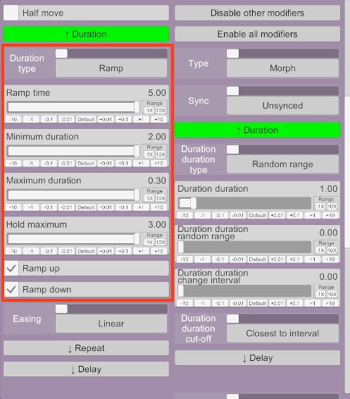](doc/ramp-1.png)

4) Add a first modifier by clicking _Add modifier_ on top
  - Set its type to _Rigidbody_
  - Select _head_ as the receiver
  - Change the _move type_ to _Relative torque_
  - Change the _direction_ to _Y_
  - Set the _minimum_ to -20 and the _maximum_ to 20

   [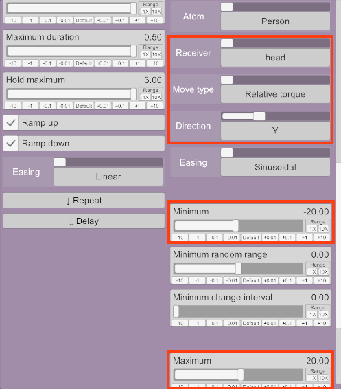](doc/ramp-2.png)

5) Add a second modifier by clicking _Add modifier_ on top
  - Set its type to _Morph_
  - Set _Sync_ to _Unsynced_
  - Click the _Duration_ button that appeared below, set _Duration_ to 2s
  - Scroll to the bottom, click _Morphs_
  - In the search box, type `mouth open`
  - Select the _Mouth Open_ morph that appears below

   [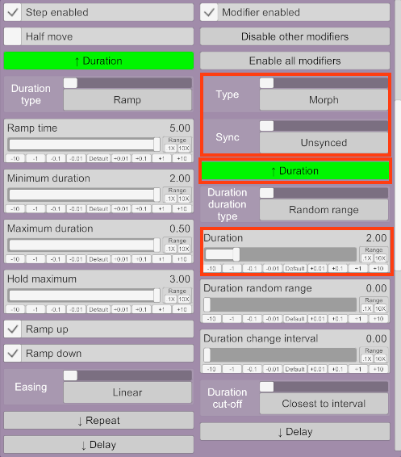](doc/ramp-3.png)&nbsp;&nbsp;&nbsp;&nbsp;[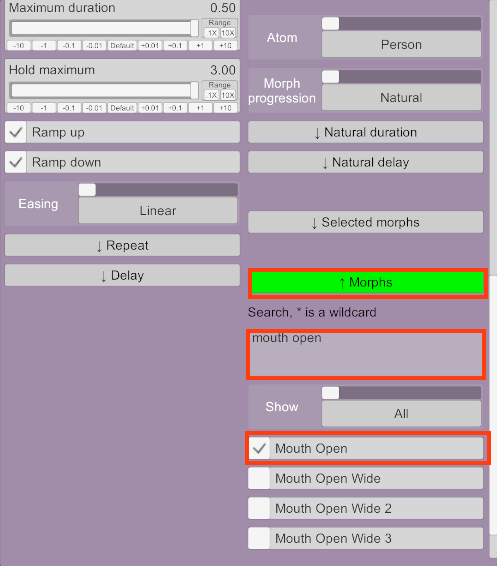](doc/ramp-4.png)

Notice the head movement speed ramping up and down, but the mouth opening and closing at a steady rate. To change the settings of the first modifier, the list at the very top allows for switching between modifiers

## User interface
Some widgets are used extensively in Synergy:

- Collapsible: a button with an arrow on it. Clicking the button will expand or collapse this section.

  [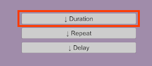](doc/collapsible-collapsed.png)
  [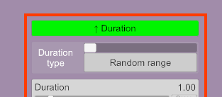](doc/collapsible-expanded.png)

- Confirm button: a combination of a checkbox and a button. Used to confirm destructive operations, such as deleting steps. Check the checkbox first to make the button available to click.

  

## Step

### Progression
Steps are normally executed sequentially, but the progression type can be changed from the _Step progression_ list.

 - _Sequential_: Steps are executed one after the other.
 - _Random_: Steps are shuffled before every round. If there is more than one step, it is guaranteed that the same step will not be executed twice in a row.
 - _Concurrent_: Steps are all executed at the same time. This is equivalent to having one step with all the modifiers, but can be useful to better organise the modifiers.

### Half move
A step is typically considered finished when its duration has elapsed completely, after which the next step is executed. When _Half move_ is enabled, a step will only execute up to half its duration before going to the next step. Once all steps have finished executing, Synergy will complete any half-move step in reverse order before doing the next round.

This can be useful for rudimentary animations. For example, step 1 could move an arm up and down and step 2 a hand left and right. If step 1 has _Half move_ enabled, then:
 - Step 1 moves the arm up and stops.
 - Step 2 moves the hand.
 - Step 1 moves the arm down.

Note that half moves don't interact well with some advanced features that change modifier synchronisation.

### Step duration
This controls how long the step executes for, as well as the timing for all modifiers. Modifiers are synchronised with their parent step by default. Modifiers will be driven from 0% to 100% during the first half of the duration, and from 100% to 0% for the second half. See [Duration](#duration) for more details.

[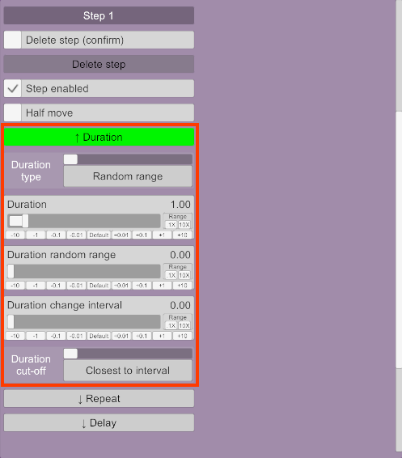](doc/duration-random.png)

### Repeat
A [random range duration](#random-range). A simple way of repeating the step duration multiple times before moving on to the next step. The values are in seconds. The step duration will be repeated until the repeat duration is exceeded.

Note that this doesn't interact well with some features like ramping or modifiers that are not synchronised with the step. A more robust way of repeating movements is to create a step with a longer duration and use unsynchronised modifiers instead.

[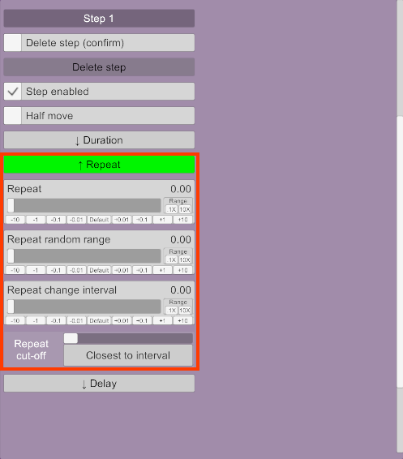](doc/step-repeat.png)

### Delay
Adds a delay in the middle and/or at the end of a step. This is a [duration](#duration).

[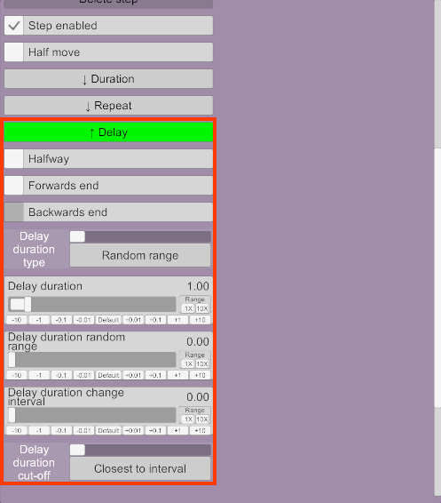](doc/step-delay.png)

The first three checkboxes depend on whether [_half move_](#half-move) is enabled for this step. For _full move_ steps (_Half move_ isn't checked), there can be a delay in the middle of the step and at the end. For _half move_ steps, there can be a delay at the end of the step when moving forwards and at the end of the step when moving backwards.

## Modifier
A modifier drives either a rigidbody, a morph, a light or audio. Some controls are available regardless:

[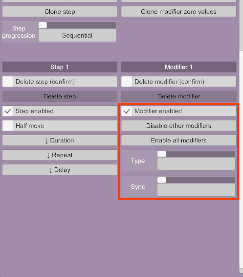](doc/modifier.png)

- _Disable other modifiers_: Enables this modifier and disables all the others in this step.
- _Enable all modifiers_: Enables all modifiers in this step.
- _Type_: The type of this modifier.
- _Sync_: The duration used by this modifier. See [Modifier duration](#modifier-duration) and [Synchronisation](#synchronisation).

The name of a modifier cannot currently be changed manually. It is automatically generated based on the modifier type and some parameters. For example, a rigidbody modifier that uses a relative force on X for the head receiver of a Person atom will be named "RF Person head X". These are the abbreviations used:

- _RF_: Rigidbody with relative force
- _RT_: Rigidbody with relative torque
- _F_: Rigidbody with force
- _T_: Rigidbody with torque
- _M_: Morph
- _LT_: Light

### Synchronisation
A modifier has a _duration_, which is used to drive its parameters. Typically, the parameters will be at 50% of their range when the duration is at 50% of its progress. By default, the duration of a modifier is the duration of its parent step. This allows for adding multiple modifiers to a step and have them synchronised. However, the _synchronisation_ option of a modifier can be changed so that it uses a different duration.

- _Step duration_: This is the default. Uses the duration of the step that contains this modifier.
- _Step progress_: If the step uses a [random range duration](#random-range), this is the same as _step duration_. If it uses a ramp, the modifier will steadily move towards 100% during ramp up and move towards 0% during ramp down (that is, the duration is the ramp time).
- _Other modifier_: Uses whatever duration the selected modifier uses.
- _Unsynced_: The modifier has its own duration and delay, independent of the step.

### Unsynced modifiers
Synergy has several options to manage unsynced modifiers because they are a great way of adding secondary movements. For example, a regular hip thrust works well with random, unsynchronised head movements such as slow rotations. There are three ways of achieving this:

 - Concurrent steps: The hip thrust and head movements can be added to two independent steps if the step progression is set to _concurrent_. The hip step can have a steady, fast rhythm, while the head step can have a slower, random duration. However, this makes it impossible to add a _second_ set of animations that executes after some time since it would execute concurrently. The various head movements like forces and rotations would also all be synchronised with each other since they're all in the same step. Head movements look better if they're all allowed to run independently and randomly.

 - Unsynced modifiers: All the hip and head modifiers can be added to the same step and be set as unsynced. The step duration would only be used as a time limit after which all modifiers stop as soon as they can. This can create good movement, but some animations look better if several movements are synced, such as a hip thrust, which is typically a combination of forces on Z and rotations on X. If these two movements are completely unsynchronised, they might end up fighting each other eventually, especially if their movement timings has randomness.

 - Synced and unsynced modifiers: The best way of handling this is to then have _some_ modifiers be synced, but others not, all in the same step. This allows for good hip thrusts while having natural a head motion. Since everything is in one step, the progression can be sequential and other animations can be created in subsequent steps. There are two ways of doing this:

	- Pick one movement as being the main one. In this case, it would be the hip thrust. All the hip thrust modifiers would be synced with the step (the default setting), while all the head modifiers would be unsynced, as they're considered secondary movements. Other unsynced modifiers like hand or feet movements can also be added.

	  The step duration then drives the hip movements, while secondary movements are unsynced and move naturally with some randomness. Once the step duration has elapsed, the various unsynced modifiers will be allowed to run to completion. Once that's over, another step with a brand new animation can be executed.

    - Create a main hip movement as an unsynced modifier, such as a force on Z. Then, the other hip modifiers such as torques can have their _sync_ option set to _Other modifier_ and linked with the first hip modifier. After that, other unsynced modifiers can be added for the head movements. In this case, the step duration is only used as a time limit, it doesn't drive anything. This is equivalent to the above, but can be more difficult to manage through the UI.

As with everything, a combination of all of the above can give a lot of flexibility. A step can have some synced modifiers, some unsynced modifiers and some modifiers synced with each others.

### Step duration and unsynced modifiers
The interaction between unsynced modifiers and their parent step is somewhat complicated, because the step has to eventually end so the next one can be executed. If there is only one enabled step, none of the following applies and modifiers are allowed to run independently indefinitely.

Once a step has finished its own duration, it must wait for all the unsynced modifiers to end. However, some modifiers might take longer than others. To avoid long pauses where only one modifier runs while everything else is frozen, the step will allow unsynced modifiers to continue running while waiting.

As an example, if a step has a duration of 5s but contains an unsynced modifier with a duration of 8s, the step will finish its execution after 5s, but the modifier will still require three more seconds. Synergy will try keep as many things moving as possible during these three seconds.

To achieve this, the step will ask all the unsynced modifiers for the shortest time they require to finish, which includes halfway delays, but not end delays. The longest time required among all the unsynced modifiers is called the _grace period_. Therefore, the grace period is how long the step has to wait until all unsynced modifiers have completed.

The step will then ask all unsynced modifiers to end _before_ the grace period elapses. This allow for some modifiers to continue their movements if they can guarantee they will end before the grace period is over. If the grace period is 3s but another unsynced modifier only needs 1.5s to run, it will be allowed to run twice while the step waits 3s for the slower modifier to end.

If a modifier has a random duration that needs to be regenerated because its interval has elapsed, it will do so if at least some part of the random range is within the grace period, in which case the range will be clamped so it doesn't exceed the grace period.

All of this is to allow shorter unsynced modifiers to continue running while a longer unsynced modifier finishes. This reduces unnatural pauses while the step is waiting to end.

### Rigidbody
A rigidbody modifier is used to drive rigidbodies, such as the head or hips.

[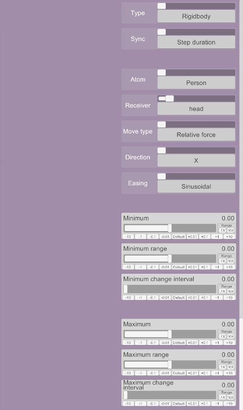](doc/rigidbody.png)

- _Atom_: The atom that owns the rigidbody. Synergy doesn't care which atom contains the plugin, it can drive any atom in a scene. It only uses the containing atom as a default for new rigidbody modifiers (if the atom contains a rigidbody).

- _Receiver_: The rigidbody to drive.

- _Move type_: How to move the rigidbody:
   - _Relative force_: Adds a relative force to the rigidbody, making it move in a direction. The direction is relative to the rigidbody's coordinate system.
   - _Relative torque_: Adds a relative torque to the rigidbody, making it rotate in a direction. The direction is relative to the rigidbody's coordinate system.
   - _Force_: Adds an absolute force to the rigidbody, making it move in a direction that is independent of the orientation of the rigidbody.
   - _Torque_: Adds an absolute torque to the rigidbody, making it rotate in a direction that is independent of the orientation of the rigidbody.

- _Direction_: For forces, the direction in which the force is applied. For torques, the axis around which the rigidbody rotates.

- _Easing_: Determines how the actual magnitude of the force or torque changes along with the duration. See [Easings](#easings).

- _Minimum_ and _Maximum_: These are [movements](#movement) and control the force or torque that is applied throughout the duration of the modifier. When the duration starts, _minimum_ is used. As the duration elapses, the magnitude of the force or torque moves towards _maximum_.

### Morph
A morph modifier drives one or more morphs.

[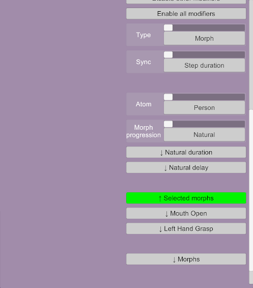](doc/morph.png)

- _Morph progression_: Defines how multiple morphs are handled:
  - _Natural_: Drives all morphs randomly based on a master duration and delay.
  - _Concurrent_: Drives all morphs at the same time based on the modifier duration.
  - _Sequential_: Drives morphs one at a time in order based on the modifier duration.
  - _Random_: Drives morphs one at a time randomly. Morphs are shuffled before every round. If there is more than one morph, it is guaranteed that the same morph will not be executed twice in a row.

#### Natural progression
The natural progression has a master duration and delay. Each morph will be given its own copy of the master duration and delay so that they will be driven concurrently.

#### Ordered progressions (sequential and random)
Ordered progressions have an additional setting _Hold halfway_. When unchecked, each morph will be driven from 0% to 100%, then back to 0% before moving to the next morph. When checked, a morph will be driven to 100% and held at this position while the subsequent morphs are handled. Once all morphs have been handled, they will be driven back to 0% in reverse order.

All the morphs will have completed their movement at the end of the modifier's duration.

#### Adding morphs
The _Morphs_ button at the bottom expands to a morph selection section.

[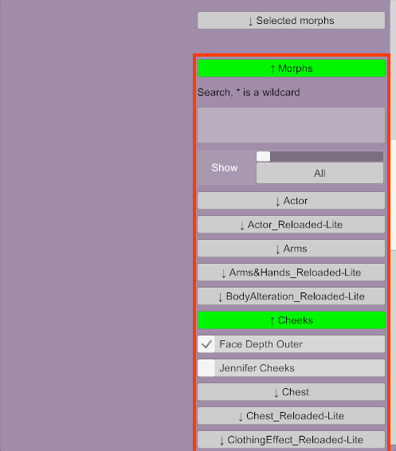](doc/morph-selection.png)

Morphs are shown in a series of collapsible sections. Expanding sections will show the individual morphs with checkboxes. Checking a box will add the morph to the modifier.

The tall box at the top is a search box. When searching, the list of morphs becomes flat, showing only morphs without collapsible categories. The search is not case sensitive and the `*` character can be used as a wildcard. For example, `lip * in` will list `Lip Bottom In`, `Lip Bottom In Left` and `Lip bottom In Right`.

The _Show_ list can filter the list to show only morphs that are poses or only morphs that are not poses.

#### Selected morphs
Once morphs have been selected, they will appear under the collapsible button _Selected morphs_. Each morph can be configured individually.

- _Enabled_: Whether this morph is used.
- _Remove_: Removes the morph from the modifier.
- _Easing_: Determines how the actual value of the morph changes along with the duration. See [Easings](#easings).
- _Minimum_ and _Maximum_: These are [movements](#movement) and control the value that is applied to the morph throughout the duration of the modifier. When the duration starts, _minimum_ is used. As the duration elapses, the value of the morph moves towards _maximum_.

### Light
A light modifier is used to change properties on a light source.

[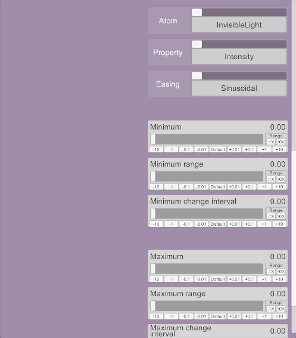](doc/light.png)

The following properties are supported:
- Intensity
- Range
- Spot angle
- On/off
- Shadow strength
- Cast shadows
- Color

For _On/off_ and _Cast shadows_, anything less than 0.5 is off and anything greater than or equal to 0.5 is on. For _Color_, two colour pickers are shown and the actual colour of the light is interpolated between the two.

### Audio
An audio modifier can play audio clips on an audio object or on the head audio of an atom.

[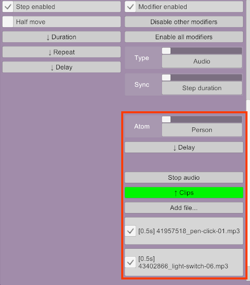](doc/audio.png)

- _Delay_: This is a [duration](#duration). The delay is applied between each clip.
- _Stop audio_: Stops any audio playing on the source. Note that this doesn't prevent anything else from starting audio, including this modifier. It merely stops whatever is playing now.
- _Clips_: A list of clips available in the scene. Selected clips will be played in a random order.
- _Add file..._: Adds a new audio file to the scene. This is equivalent to adding a clip in the _Scene Audio_ tab.

## Presets
Expanding the _Presets_ section in the top-right gives option to save or load presets.

[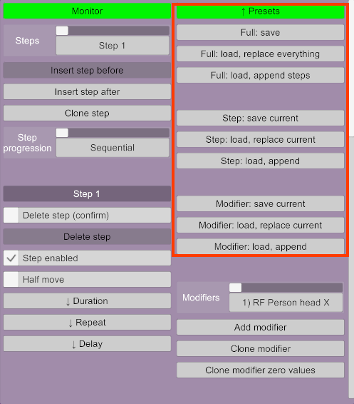](doc/presets.png)

There are three groups of buttons:
- _Full_: A full preset contains all the steps and their modifiers.
- _Step_: A preset for a single step.
- _Modifier_: A preset for a single modifier.

Each group has three buttons:
- _Save_: Saves the preset.
- _Replace_: Replace everything, the current step, or the current modifier.
- _Append_: Appends all the step, one step, or one modifier.

Presets are saved in `Saves/Synergy` by default. Full presets have the extension `.syn`, step presets `.synstep` and modifier presets `.synmodifier`.

## Monitor
Synergy has an extensive monitor that was mostly used during development, but can also be useful to understand what the heck is going on in more complicated scenes. Widgets in the monitor are strictly read-only.

The green "Close monitor" at the top is used to close the monitor.

[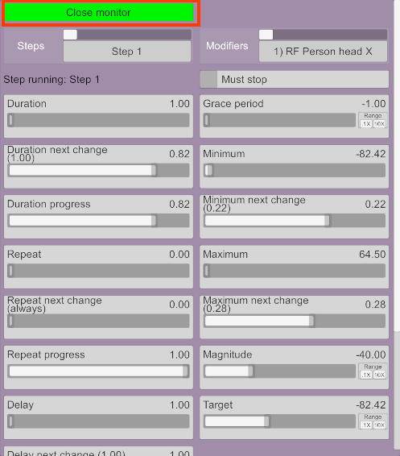](doc/monitor-open.png)

Understanding all the different widgets is left as an exercise to the reader.

## Duration
Durations are used in many parts of Synergy, such as in steps, delays or unsynchronised modifiers.

There are two types of durations: _Random range_ and _Ramp_.

### Random range
A duration that can vary within a specific range. The values are randomly generated after a given interval.

- _Duration_: The time in seconds that something takes to execute.

- _Duration random range_: Specifies a range to generate random durations around _Duration_. If the duration is 5 and the random range is 1, then the actual duration will be randomised between 4 and 6 inclusively. If 0, the duration is always exact.

- _Duration change interval_: The time in seconds before a new random duration is generated. If 0, the duration is randomised every time it finishes.

- _Duration cut-off_: Advanced setting. Determines the time when the next random duration is generated when the current duration isn't an exact factor of the interval. This avoids sudden changes in velocities.
  - _Closest to interval_: Default. The next random duration will be generated as close to the given interval as possible, but might be before or after depending on the duration. For example, if the current duration is 1.5s and the change interval is 4s, the next random duration will be generated at 4.5s. If the current duration is 1.8s and the change interval is 4s, the next random duration will be generated at 3.6s.
  - _Always before interval_: The random duration will never last longer than the interval specifies.
  - _Always after interval_: The random duration will always last at least as long as the interval specifies.
  - _Exact_: The next random duration will always be generated exactly at the specified interval, even if something is in the process of moving. This can create jerky movements once in a while.

### Ramp
A duration that speeds up and slows down over a period of time.

[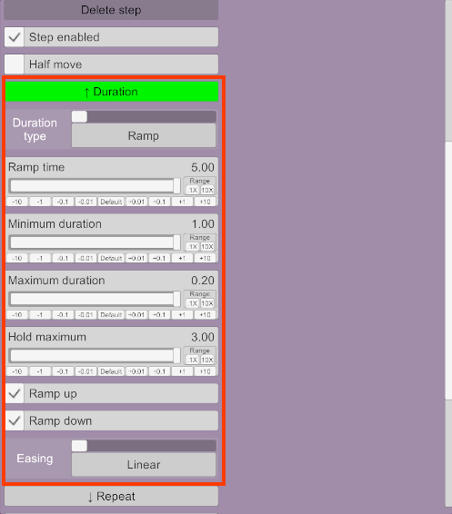](doc/duration-ramp.png)

- _Ramp time_: The time during which the duration will be ramped up or down. If the ramp time is 5s, the actual duration will ramp up for 5s, then down for 5s.
- _Minimum duration_: The duration when ramping starts and ends.
- _Maximum duration_: The duration when ramping is completely up.
- _Hold maximum_: Time in seconds to hold the duration when ramped up at the maximum.
- _Ramp up_: If disabled, the duration will immediately start at the maximum duration and ramp down only.
- _Ramp down_: If disabled, the duration will ramp up, hold (if set), then immediately change the duration to the minimum.
- _Easing_: Determines how the actual duration is calculated based on the ramp time. See [Easings](#easings).

As an example, if the ramp time is 5s, the minimum and maximum durations 1s and 0.2s respectively, and the hold maximum time 3s:
 - The initial duration will be 1s.
 - The duration will decrease over 5s until it reaches the maximum of 0.2s.
 - The maximum 0.2s duration will be held for 3s.
 - The duration will then increase over 5s until it reaches the minimum of 1s.
 - The total duration will be 13s.

## Movement
Movements are used throughout Synergy, such as in rigidbody and morph modifiers.

[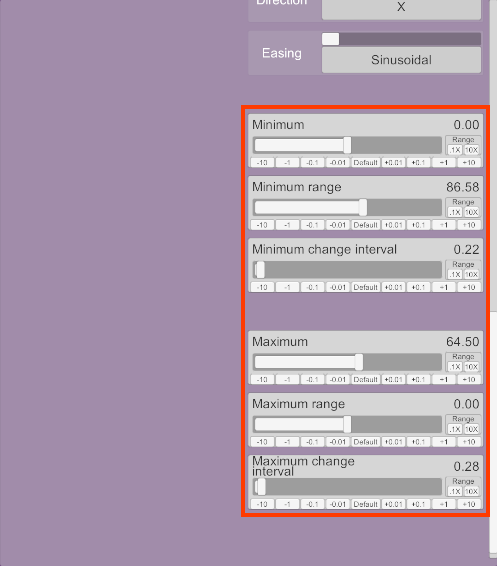](doc/movement.png)

Movements have _minimum_ and _maximum_ values that are used to drive various objects based on a [duration](#duration). As a duration elapses, the _magnitude_ of a movement moves towards the maximum and then back down to the minimum.

The _range_ is used to generate random values. For example, if the _minimum_ is 5 and the random range is 1, then the actual minimum will be randomised between 4 and 6 inclusively. If 0, the value is always exact.

_Change interval_ is the time in seconds before a new random value is generated. If 0, the value is randomised every time it is used.

## Easings
Synergy uses easings to modify how values change over time.

_From [https://easings.net/](https://easings.net/)_

## License
[Creative Commons Zero](https://creativecommons.org/share-your-work/public-domain/cc0). This project is in the public domain.
